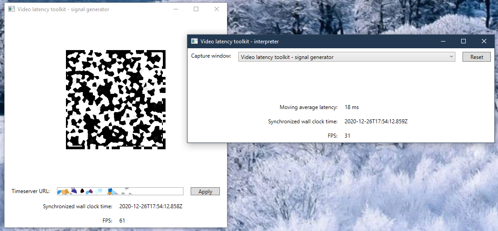

# Video latency toolkit

How do you accurately measure end to end video latency? This toolkit provides:

1. The signal generator - an app that generates a machine-readable image encoding the current wall clock time.
1. The signal interpreter - an app that reads the image and determines the latency.

The generator can emit:

* A real-time updated window (for feeding input via screen capture).

The interpreter can process:

* A screen capture (for capturing a video player window).

The processed video samples can include other content besides the time signal - the interpreter knows how to find the embedded signal from among other content. Just ensure that the entire signal generator window is visible in the output.

# Wall clock synchronization

Clock synchronization between generator and interpreter is assumed. Easiest method might be to just run them on the same PC.

# Processing

There is some processing latency - perform a "dry run" by providing generator output directly to the interpreter to determine the procecssing latency on your system.